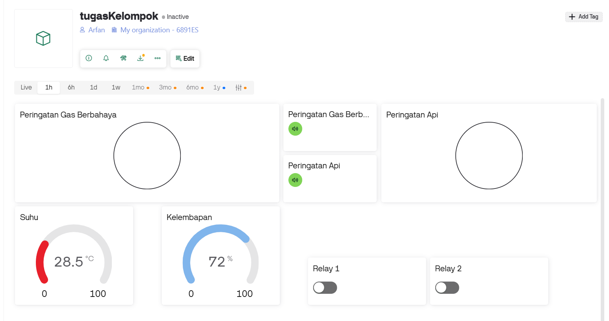
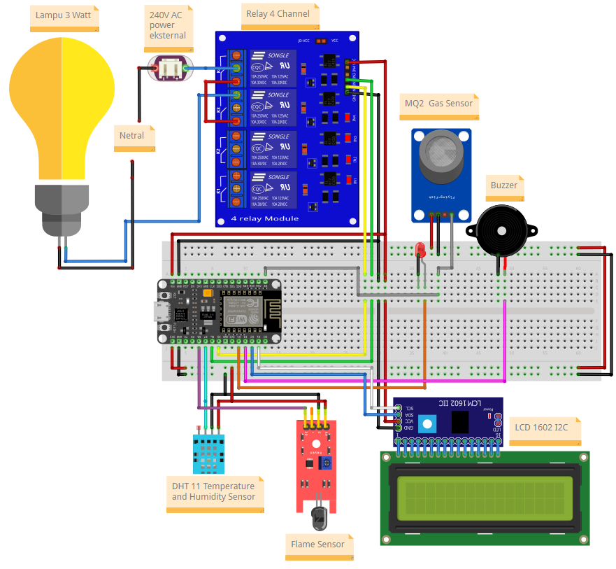

# Climate Light: IoT Multi-Threat Monitoring & Safety System

**Climate Light** is an IoT project designed for real-time environmental monitoring and hazard detection. Built using the ESP8266 (NodeMCU) and the Blynk IoT platform, this system actively monitors temperature, humidity, flammable gas, and the presence of fire.

It provides a robust alerting system with both local alarms (a multi-priority buzzer, LED, and LCD screen) and remote notifications sent directly to your mobile device via the Blynk app. The system also features remote control capabilities, allowing you to toggle two AC devices (like lights or fans) from anywhere in the world.

]This project was developed by a team of Informatics Engineering students from the University of Lampung. 

## 🚀 Key Features

  * **Real-time Monitoring:** Tracks ambient temperature and humidity using a **DHT11** sensor.
  * **Gas Hazard Detection:** Senses flammable/harmful gas levels with an **MQ-2** sensor and triggers an alarm if the value exceeds a set threshold (300). 
  * **Flame Detection:** Uses a **Flame Sensor** to detect open flames for immediate fire alerts. 
  * **Remote Device Control:** Toggle two separate AC devices (e.g., 240V lamps) remotely using **Relay** switches controlled from the Blynk app (Virtual Pins V0, V1). 
  * **Prioritized Multi-Threat Alarm:** A smart alarm system with four distinct buzzer/LED patterns based on the detected threat level: 
      * **Level 1 (High Temp):** Slow Beep
      * **Level 2 (Gas Detected):** Medium Beep
      * **Level 3 (Flame Detected):** Fast Beep
      * **Level 4 (All Threats):** *Fastest Beep* (Fire, Gas, & High Temp simultaneously)
  * **Local LCD Display:** A 16x2 I2C LCD shows system status (WiFi/Blynk connection), cycles through sensor readings during normal operation, and displays specific warning messages during an alarm (e.g., "\!\!KEBAKARAN\!\!", "GAS BERBAHAYA"). 
  * **Instant Mobile Alerts:** Sends push notifications (Log Events) to the Blynk app for fire, gas, and high-temperature alerts, including the device's pre-defined location for context. 

## 📱 Blynk Dashboard

The Blynk dashboard provides a clean interface for monitoring all sensor data in real-time and accessing the remote control toggles.


## 🛠️ Hardware & Software

### Hardware Components

  * NodeMCU ESP8266
  * DHT11 (Temperature & Humidity Sensor)
  * MQ-2 (Gas Sensor Module)
  * Flame Sensor Module
  * 4-Channel Relay Module
  * Active Buzzer
  * 5mm LED (Red)
  * 1602 16x2 I2C LCD Display
  * Breadboard & Jumper Wires
  * (Opsional) AC Light Bulb, Socket, and external 240V AC power source for relay testing.

### Software, Services & Libraries

  * **Arduino IDE:** To compile and upload the firmware.
  * **Blynk IoT:** For the cloud backend, mobile dashboard, and notifications.
  * **Required Libraries:**
      * `BlynkSimpleEsp8266.h`
      * `ESP8266WiFi.h`
      * `DHT.h` (by Adafruit)
      * `Wire.h`
      * `LiquidCrystal_I2C.h` (by Frank de Brabander)

## 🔌 Wiring Diagram & Pinout

All components are connected to the NodeMCU ESP8266 as shown in the diagram and table below.


### Pin Configuration

| Component | Pin on NodeMCU |
| :--- | :--- |
| **Buzzer** | `D3` |
| **LED** | `D4` |
| **DHT11 Sensor** (Data) | `D7` |
| **MQ-2 Sensor** (AOUT) | `A0` |
| **Flame Sensor** (DOUT) | `D8` |
| **Relay 1** (IN1) | `D5` |
| **Relay 2** (IN2) | `D6` |
| **LCD SDA** | `D2` |
| **LCD SCL** | `D1` |
| VCC (Sensors, LCD) | `3.3V` / `Vin` |
| GND | `GND` |

> ⚠️ **High Voltage Warning:** Connecting the relay module to an AC mains power source is extremely dangerous and carries a risk of electric shock, fire, or death. Always disconnect the AC power before making any adjustments. If you are not experienced, please seek help from a qualified professional.

## ⚙️ Setup & Installation Guide

Follow these steps to get your project up and running.

### 1\. Blynk App Setup

1.  **Create a New Template:** In the Blynk Web Dashboard or Mobile App, create a new template.
2.  **Get Credentials:** Your `BLYNK_TEMPLATE_ID`, `BLYNK_TEMPLATE_NAME`, and `BLYNK_AUTH_TOKEN` will be generated. You will need these for the firmware.
3.  **Configure Datastreams:** Go to the "Datastreams" tab and create the following virtual pins:

| Name | Virtual Pin | Data Type | Units | Min/Max |
| :--- | :--- | :--- | :--- | :--- |
| Relay 1 | `V0` | Integer | - | 0 / 1 |
| Relay 2 | `V1` | Integer | - | 0 / 1 |
| Suhu | `V2` | Double | °C | 0 / 100 |
| Kelembapan | `V3` | Integer | % | 0 / 100 |
| Gas Sensor | `V4` | Integer | ppm | 0 / 10000 |
| Peringatan Api | `V5` | Integer | - | 0 / 255 |
| deviceLocation | `V6` | String | - | - |

4.  **Design the Dashboard:** Drag and drop widgets onto your dashboard and assign them to the Datastreams you just created (e.g., Switch for V0/V1, Gauges for V2/V3, etc.).

### 2\. Firmware Setup

1.  **Clone the Repository:**

    ```bash
    git clone https://github.com/arfanPramudya/Climate-Light-IoT-Environmental-Monitor.git
    ```

2.  **Install Libraries:** Open the `.ino` file in the Arduino IDE. Go to **Sketch \> Include Library \> Manage Libraries...** and install the libraries listed in the "Software & Services" section above.

3.  **Update Credentials:** Open the `.ino` file and fill in your unique credentials at the top of the file:

    ```cpp
    // --- UPDATE THESE ---
    #define BLYNK_TEMPLATE_ID "Your Template ID"
    #define BLYNK_TEMPLATE_NAME "Your Template Name"
    #define BLYNK_AUTH_TOKEN "Your Auth Token From Blynk"

    char auth[] = BLYNK_AUTH_TOKEN;
    char ssid[] = "Your-WiFi-Name";
    char pass[] = "Your-WiFi-Password";
    // --- END UPDATE ---
    ```

### 3\. Upload the Code

1.  **Connect Your Board:** Plug your NodeMCU ESP8266 into your computer via USB.
2.  **Select Board:** In the Arduino IDE, go to **Tools \> Board** and select "NodeMCU 1.0 (ESP-12E Module)".
3.  **Select Port:** Go to **Tools \> Port** and select the correct COM port.
4.  **Upload:** Click the "Upload" button (right arrow) and wait for the process to complete.
5.  **Run:** Once uploaded, the device will connect to your WiFi and Blynk. You can open the Serial Monitor (set to 115200 baud) to see status messages and sensor readings.

## 👨‍💻 Project Team

This project was created as an academic assignment by:

  * **Arfan Andika Pramudya** (2315061016) - Team Leader
  * **Dhito Aryo Trengginas** (2315061015) 
  * **Muhammad Farhan** (2315061083) 
  * **M. Valerian Irwansyah** (2315061027) 
  * **M. Aqsha Fadilah J** (2315061127) 

-----

## 📄 License

This project is licensed under the MIT License. See the `LICENSE` file for details.
